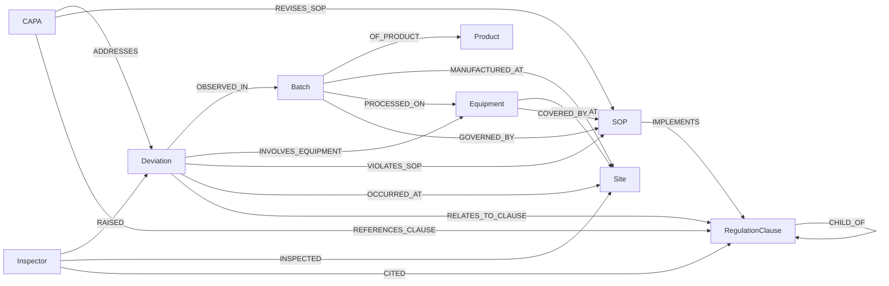

# Ontology v0.1

Machine-readable definition: [`ontology.schema.json`](ontology.schema.json) (generated by `build_schema.py`; edit the Python, not the JSON).

## Design decisions
- **Graph-document format** `{nodes, edges}`: the schema constrains *which relationship may connect which labels* (e.g. `CAPA-[ADDRESSES]->Deviation` is valid, the reverse is not). This gives the extraction step (Version 1, point 2) a strict target.
- **Provenance is mandatory** (`sources[]` with `doc_id` + `locator` on every node and edge). This is what makes "every answer must cite a source" enforceable later.
- **Entity resolution hooks**: every node has `name` (canonical) + `aliases`. The synthetic docs deliberately refer to one press as "TP-03", "Press #3" and "Compression Line 3 press".
- **Stable IDs**: `PRD-`, `BAT-`, `EQP-`, `SOP-`, `DEV-`, `CAP-`, `REG-`, `SIT-`, `INS-` + suffix. Business identifiers (deviation number, batch number, ...) are kept as properties, not IDs, because the same record is often written several ways.
- **Clause hierarchy**: `CHILD_OF` lets a question about `21 CFR 211.68` also reach records that cite `211.68(a)`.
- **Inspector** covers regulators *and* internal/third-party auditors (`inspector_type`). Real FDA warning letters usually don't name individual investigators, so real Inspector nodes will often be an office/agency; only fictional named people appear in the synthetic data.
- **`verification_status`** on `RegulationClause`: `verified_against_source` only if the title/number was checked against the fetched text; otherwise `unverified`.
